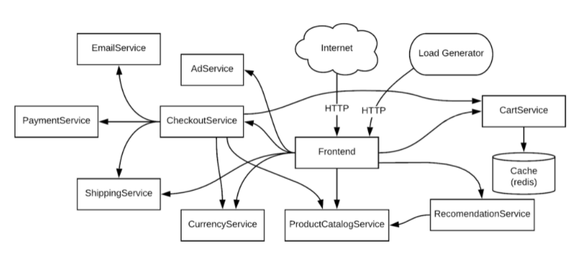

# 项目说明

**项目结构仿照Kratos 架构**

## proto 生成代码

```cmd
protoc -I . --go_out=plugins=grpc:. proto\demo_base.proto
```

**生成的文件在每个项目下internal下的conf，，proto文件了管理方便在总目录下，但是生成要放在子目录项目下**


## 项目预期架构



## 完成进度


### 初始项目结构图

### 第一步

1. 完成项目架构
2. 编写proto 文件
